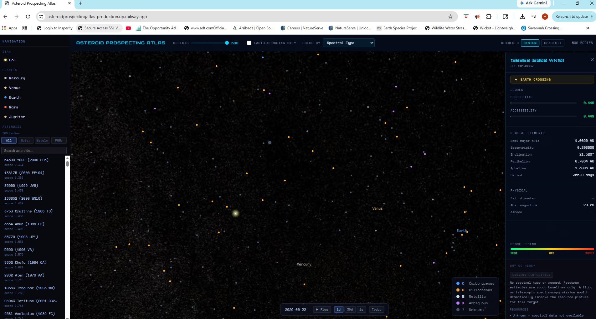

# Asteroid Prospecting Atlas

A scientifically grounded 3D solar system explorer that ranks near-Earth asteroids by mining potential. Browse 500 real asteroids sourced from NASA JPL, filtered and scored by resource composition, orbital accessibility, and physical characteristics.

**[Live Demo →](https://asteroidprospectingatlas-production.up.railway.app)**



---

## What it does

- Ingests real near-Earth asteroid data from the NASA JPL Small Body Database
- Scores each asteroid on **prospecting potential** (resource value × accessibility) and **orbital accessibility** (delta-v similarity to Earth)
- Classifies asteroids by spectral type (C, S, M, X) with estimated water, metal, and PGM mass
- Renders all 500 asteroids in a live 3D solar system with two renderers:
  - **Cesium** — WebGL globe renderer with orbit arcs and animated selection highlights
  - **Spacekit.js** — Three.js-based orrery with Keplerian orbital mechanics
- Time controls let you scrub or play forward through orbital positions
- Sidebar navigation with search and resource-type filtering
- Selecting an asteroid shows its orbital elements, physical properties, and "why go here" summary

---

## Tech Stack

| Layer | Technologies |
|---|---|
| Backend | Python, FastAPI, PostgreSQL, SQLAlchemy |
| Frontend | React 18 + TypeScript, CesiumJS, Resium, Spacekit.js, Vite |
| Data | Pandas, NumPy, Astropy, NASA JPL Small Body Database API |
| Testing | pytest (100% coverage), Vitest, React Testing Library |
| Quality | Ruff, pip-audit, GitHub Actions CI/CD |
| Infrastructure | Docker Compose (local), Railway (production) |

---

## Local Development

### Prerequisites
- Python 3.11+
- Node 18+
- Docker (for PostgreSQL)

### 1. Start PostgreSQL

```bash
docker compose up -d
```

### 2. Set up the Python environment

```bash
python -m venv .venv

# Mac/Linux
source .venv/bin/activate

# Windows PowerShell
.venv\Scripts\Activate.ps1

pip install -e .[dev]
```

### 3. Seed the database

```bash
python scripts/seed_db.py
```

This fetches 500 near-Earth asteroids from NASA JPL (~1 minute).

### 4. Start the API

```bash
uvicorn asteroid_atlas.api.main:app --reload --app-dir src
```

API runs at `http://localhost:8000`. Interactive docs at `http://localhost:8000/docs`.

### 5. Start the frontend

```bash
cd frontend
npm install
npm run dev
```

Frontend runs at `http://localhost:5173`.

### 6. Run tests

```bash
# Backend (100% coverage enforced)
pytest

# Frontend
cd frontend && npx vitest run
```

---

## Environment Variables

| Variable | Service | Description |
|---|---|---|
| `DATABASE_URL` | Backend | PostgreSQL connection string |
| `ALLOWED_ORIGINS` | Backend | Comma-separated list of allowed CORS origins |
| `VITE_API_BASE` | Frontend | Base URL of the FastAPI backend |

---

## Project Structure

```
asteroid_prospecting_atlas/
├── .github/workflows/   CI/CD pipeline
├── docs/                Architecture, scoring design, data sources
├── frontend/            React + CesiumJS + Spacekit.js visualization
├── scripts/             Database seed script
├── src/asteroid_atlas/  FastAPI backend source
│   ├── analytics/       Scoring, orbital metrics, resource profiles
│   ├── api/             FastAPI routes
│   ├── db/              SQLAlchemy session and models
│   └── ingest/          NASA JPL data pipeline
├── tests/               Backend test suite
├── docker-compose.yml   Local PostgreSQL
└── pyproject.toml       Python project config
```

---

## Scoring Model

Each asteroid receives two scores (0–1):

- **Prospecting Score** — weighted combination of estimated resource mass (water, metals, PGMs) normalized against the full dataset
- **Accessibility Score** — orbital similarity to Earth based on semi-major axis, eccentricity, and inclination delta-v approximation

Full methodology in [`docs/scoring.md`](docs/scoring.md).

---

## Vision

Asteroid Prospecting Atlas is designed to evolve into a platform combining planetary science, orbital mechanics, resource estimation, and mission accessibility analysis — providing an open, transparent framework for evaluating asteroid resource potential and mission feasibility.
